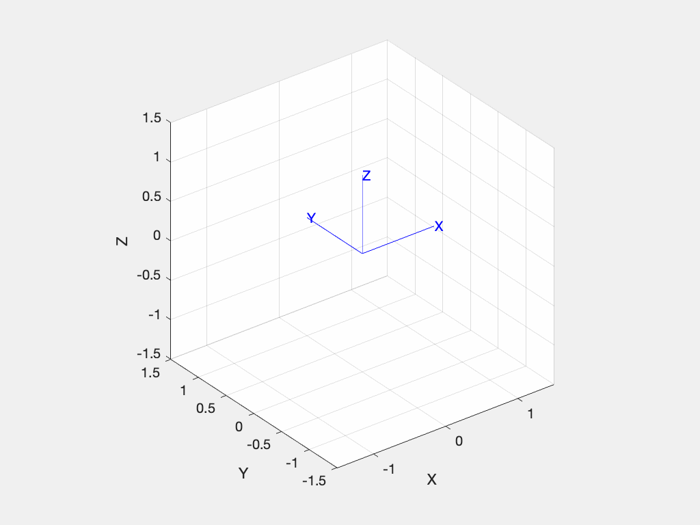

[](https://www.mathworks.com/matlabcentral/fileexchange/70373-spatial-math-toolbox)
[](https://travis-ci.com/petercorke/spatial-math)

[](https://opensource.org/licenses/MIT)
[](https://GitHub.com/petercorke/spatialmath-matlab/graphs/commit-activity)
[](https://GitHub.com/petercorke/robotics-toolbox-matlab/stargazers/)
 
# Spatial Math Toolbox for MATLAB&reg;

## Synopsis

This Toolbox contains functions and classes to represent orientation and pose in 2D and 3D (SO(2), SE(2), SO(3), SE(3)) as orthogonal and homogeneous transformation matrices, unit quaternions, twists, triple angles, and matrix exponentials. The Toolbox also provides functions for manipulating these datatypes, converting between them, composing them, graphically displaying them, and transforming points and velocities.

Much of this Toolbox functionality was previously in the [Robotics Toolbox for MATLAB](https://github.com/petercorke/robotics-toolbox-matlab).

Advantages of the Toolbox are that:

  * the code is mature and provides a point of comparison for other implementations of the same algorithms;
  * the routines are generally written in a straightforward manner which allows for easy understanding, perhaps at the expense of computational efficiency. If you feel strongly about computational efficiency then you can always rewrite the function to be more efficient, compile the M-file using the MATLAB compiler, or create a MEX version;
  * source code is available for the benefit for understanding and teaching.

There is now a Python version of this Toolbox on [GitHub](https://github.com/petercorke/spatialmath-python) and [PyPI](https://pypi.org/project/spatialmath-python).
  
## Manual

Comprehensive detail of all functions is provided in the [PDF-format manual (~200 pages)](https://github.com/petercorke/spatialmath-matlab/releases/download/untagged-a2f9c8b2bd21cca9fe39/spatialmath.pdf).

## Installation

From the MATLAB toolstrip Home>Add-Ons>Get Add-Ons will bring up the Add-On Explorer.  Enter "spatial math" into the search box, select the first entry and then click "Add from GitHub".  The Toolbox will be downloaded and added to your path.


## Code Example

```matlab
>> R = rotx(0.2)  % SO(3) rotation matrix
R =
    1.0000         0         0
         0    0.9801   -0.1987
         0    0.1987    0.9801
```

which we could animate simply as
```matlab
>> tranimate(R)
```



Convert roll-pitch-yaw angles to a unit quaternion
```matlab
>> R = rpy2r(10, 20, 30, 'deg')
R =
    0.8138   -0.4410    0.3785
    0.4698    0.8826    0.0180
   -0.3420    0.1632    0.9254
```
which uses the ZYX convention by default, ie. this is a rotation by the yaw angle (30 deg) about the Z-axis, followed by a rotation by the pitch angle (20 deg) about the Y-axis, followed by a rotation by the roll angle (10 deg) about the X-axis.  We can convert this to a unit quaternion
```matlab
>> q = UnitQuaternion(R)
q = 
0.95155 < 0.038135, 0.18931, 0.2393 >
```
or create the unit quaternion directly using a variant constructor
```matlab
>> q2 = UnitQuaternion.rpy(10, 20, 30, 'deg')
q2 = 
0.95155 < 0.038135, 0.18931, 0.2393 >
```

## What's new

* Continuous integration using [Travis CI](https://travis-ci.com/petercorke/spatial-math) and [codecov](https://codecov.io/gh/petercorke/spatial-math)
* Support for spatial vector notation (Featherstone's 6D vectors)
* `prod()` method for all `RTBPose` subclasses and `Twist`
* Factored out of the [Robotics Toolbox for MATLAB](https://github.com/petercorke/robotics-toolbox-matlab).  RTB now contains only robotics specific code, eg. for manipulator arms and mobile robots.

## Online resources:

* [Tutorial style exampes](https://github.com/petercorke/spatial-math/wiki)
* [Home page](http://www.petercorke.com)
* [Robotics, Vision & Control (book)](http://petercorke.com/wordpress/rvc)
* [Discussion group](http://groups.google.com/group/robotics-tool-box?hl=en)

Please email bug reports, comments or code contribtions to me at rvc@petercorke.com

## Octave

The functions, but not the classes, should work fine with Octave 5.x.

## Contributors

Contributions welcome.  There's a user forum at [http://tiny.cc/rvcforum](http://tiny.cc/rvcforum) for this Toolbox and also
[Robotics Toolbox for MATLAB](https://github.com/petercorke/robotics-toolbox-matlab).

## License

This toolbox is released under MIT Licence.
